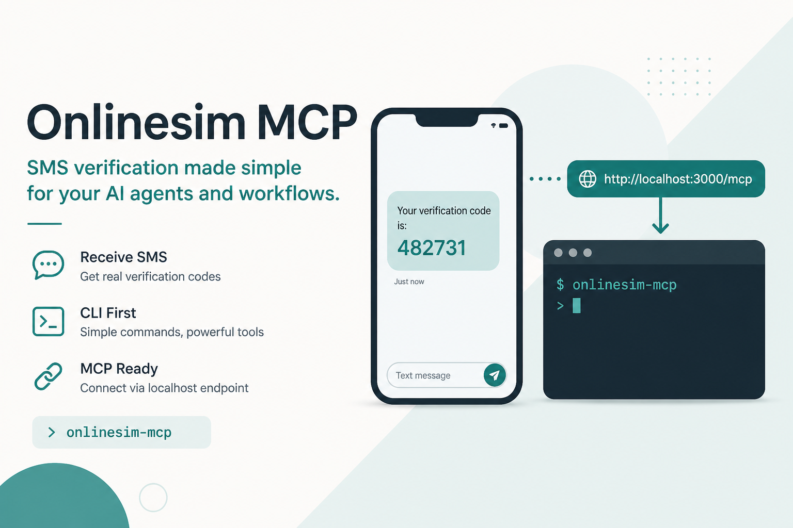

[](https://github.com/on-org/onlinesim-mcp/releases/latest)
[](https://github.com/on-org/onlinesim-mcp/releases)
[](https://www.rust-lang.org/)
[](https://modelcontextprotocol.io)
[](https://github.com/on-org/onlinesim-mcp/issues)
[](https://github.com/on-org/onlinesim-mcp/stargazers)
[](LICENSE)



# Onlinesim MCP

Local [MCP](https://modelcontextprotocol.io) server (Streamable HTTP) and CLI for [Onlinesim](https://onlinesim.io): order receive-only numbers and read SMS.

The API key lives in local config (`onlinesim login`) or `ONLINESIM_APIKEY`. Never pass the key in tool arguments.

## Install

```bash
# macOS / Linux
curl -fsSL https://raw.githubusercontent.com/on-org/onlinesim-mcp/master/install.sh | sh

# Windows PowerShell
irm https://raw.githubusercontent.com/on-org/onlinesim-mcp/master/install.ps1 | iex
```

Binaries are published on [GitHub Releases](https://github.com/on-org/onlinesim-mcp/releases). Build-from-source is for maintainers with private source access.

## How it works

```
MCP client  ── Streamable HTTP ──►  onlinesim mcp  ──►  Onlinesim API
                                  http://HOST:PORT/mcp
CLI: onlinesim sms|rent|…  ────────────────────────────┘
                       local config + ONLINESIM_APIKEY
```

Transport: [Streamable HTTP](https://modelcontextprotocol.io/specification/2025-03-26/basic/transports#streamable-http) — a single `/mcp` endpoint (JSON-RPC POST, SSE when needed). Clients discover tools via `tools/list`; you do not need to list them in the client config.

Two product lines (do not mix tools):

1. **Quick SMS** — short-lived number for a service (`telegram`, `whatsapp`, …): balance → catalog → order → user enters the number on the target site → wait/check → cancel.
2. **Rent** — long-term rental: list rentals → rent → messages / extend / cancel.

Tariff catalogs are cached locally (~5 min). Balance and order operations always hit the API.

Statuses: `TZ_NUM_WAIT` — waiting for SMS; `TZ_NUM_ANSWER` — code received. Ids appear in `[brackets]`: `serviceId` (slug), `countryId` / `rentalId` (numeric), Order / Receipt ID (`tzid`).

## Quick start

```bash
onlinesim login
onlinesim doctor
onlinesim balance
onlinesim mcp
# default: http://127.0.0.1:8787/mcp
# other bind: onlinesim mcp --bind 127.0.0.1:9000
# non-loopback requires: onlinesim mcp --bind 0.0.0.0:8787 --allow-remote
```

The MCP client cannot connect until `onlinesim mcp` is running. Non-loopback binds are refused unless `--allow-remote` (the MCP endpoint has no auth). For access from another host or the cloud, put HTTPS and access control in front yourself — the default bind is loopback only.

## Connect an MCP client

Endpoint: `http://127.0.0.1:8787/mcp` (or your `--bind`).

Config file names and keys differ by client; the protocol is the same.

### Claude Code

```bash
claude mcp add --transport http onlinesim http://127.0.0.1:8787/mcp
```

Or in `.mcp.json` / user config (`type` is required):

```json
{
  "mcpServers": {
    "onlinesim": {
      "type": "http",
      "url": "http://127.0.0.1:8787/mcp"
    }
  }
}
```

### VS Code (GitHub Copilot)

`.vscode/mcp.json` — root key is `servers`, not `mcpServers`:

```json
{
  "servers": {
    "onlinesim": {
      "type": "http",
      "url": "http://127.0.0.1:8787/mcp"
    }
  }
}
```

### Clients that use `mcpServers` + `url`

```json
{
  "mcpServers": {
    "onlinesim": {
      "url": "http://127.0.0.1:8787/mcp"
    }
  }
}
```

### Codex

```bash
codex mcp add onlinesim --url http://127.0.0.1:8787/mcp
```

Or in `~/.codex/config.toml`:

```toml
[mcp_servers.onlinesim]
url = "http://127.0.0.1:8787/mcp"
```

### Claude Desktop / Claude.ai

- **Public HTTPS URL** — Settings → Connectors → Add custom connector → paste the endpoint URL.
- **Local `http://127.0.0.1/…`** via `url` in `claude_desktop_config.json` is usually unsupported (that file is stdio-oriented). Options: a Custom Connector on proxied HTTPS, or a stdio bridge to Streamable HTTP (e.g. `npx -y mcp-remote http://127.0.0.1:8787/mcp --transport http-only`).

Any other client with Streamable HTTP support: use the same URL and HTTP / streamable-http transport.

## MCP tools

| Tool | Purpose |
|------|---------|
| `get_account_balance` | Balance before spending |
| `search_sms_services` | Search Quick SMS services |
| `get_sms_service_countries` | Countries for a `serviceId` |
| `find_cheapest_sms_countries` | Cheapest `countryId`s by price |
| `order_sms_verification` | Order a number (**spends** balance) |
| `wait_sms_verification` | Wait for a code (default 45s, max 60; shared poller) |
| `check_sms_verification` | Status / code by `orderIds` |
| `cancel_sms_verification` | Close order(s) |
| `list_sms_orders` | Active Quick SMS orders |
| `list_sms_rentals` | Rental tariffs |
| `rent_sms_number` | Rent a number (**spends** balance) |
| `get_sms_rental_messages` | SMS for a rental |
| `extend_sms_rental` | Extend |
| `cancel_sms_rental` | Cancel a rental |

### Typical agent flow (Quick SMS)

```
get_account_balance
→ search_sms_services → find_cheapest_sms_countries
→ order_sms_verification          # serviceId/countryId from catalog only
→ user enters the number on the target site and requests SMS
→ wait_sms_verification(orderId)  # or poll check every 15–30s
→ cancel_sms_verification
```

Bulk: `orderIds` / `receiptIds` (1–20), or omit / `[]` for all active. Cancel-all only when the user explicitly asks to close everything. Prefer one bulk call — never one RPC per number.

## CLI

Human-readable by default. For scripts and integrations, use `--format json` (stable envelope on stdout):

```bash
onlinesim --format json balance
onlinesim --format json sms search telegram
# { "ok": true, "command": "sms.search", "data": { ... } }
```

```bash
onlinesim sms search telegram
onlinesim sms countries telegram
onlinesim sms order telegram 7
onlinesim sms check
onlinesim sms cancel 1001
onlinesim sms list

onlinesim rent list
onlinesim rent order 7 7
onlinesim rent messages
onlinesim rent extend 1001 7
onlinesim rent cancel 1001

onlinesim config show | path | set
onlinesim logout
```

## Dev / mock

Build with `--features dev` to use `MockOnlineSim` (no API key, no real HTTPS). State file: `…/onlinesim/mock-state.json` or `ONLINESIM_MOCK_STATE`. Reset: `onlinesim config reset-mock`.

There is no `--dev` / `--live` CLI flag — mock vs live is compile-time only.

## License

Apache License 2.0
